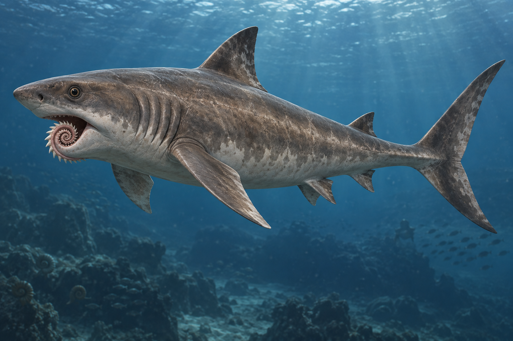

# T05 · *Helicoprion* — reference board

> **Scope:** modelling and art-direction board assembled only from existing repository research and canonical/reference catalogues. It is not a new anatomical study.

| Field | Working value |
| --- | --- |
| Representative length | **5 m** (maximum recorded in the swimming dataset: 7.6 m) |
| Existing catalogue range | 3–7.5 m |
| Age / locality context | The animal is a Permian relict slot; the research file explicitly flags the temporal exception. |
| Canonical status | See the canonical manifest; approval state can change independently of this board. |

## Panel A · Current canonical life reconstruction

The canonical pose is an internal visual contract, not fossil evidence. Colour, pattern, soft-tissue volume and pose remain **inferred** or **speculative** unless the cited research says otherwise.

## Panel B · Existing skeletal or specimen evidence

**Catalogue evidence:** [Helicoprion sp. (fossil shark tooth whorl) (Phosphoria Formation, mid-Permian; Idaho, USA) 6 (34254480436).jpg](https://commons.wikimedia.org/wiki/File:Helicoprion_sp._(fossil_shark_tooth_whorl)_(Phosphoria_Formation,_mid-Permian;_Idaho,_USA)_6_(34254480436).jpg) — James St. John, CC BY 2.0. Helicoprion sp. - fossil shark tooth whorl from the Permian of Idaho, USA. (public display, FHPR L2003-2, Utah Field House of Natural History, Vernal, Utah, USA) This remarkable fossil is a symphyseal tooth whorl from the lower jaw of an edestoid shark. It is in fossiliferous limestone of the Permia

This linked image is selected from the existing repository catalogue by a filename/description match for skeletal, fossil, holotype, specimen, or skull evidence. Check whether it depicts the target species or a comparative taxon before modelling.

## Panel C · Anatomy that must read

- **Model target:** Fadenia-type fusiform body; tooth whorl inside lower jaw with only front arc exposed.
- Preserve the full silhouette, tail and every limb or fin in modelling inputs.
- Treat hard-part anatomy described from specimens as **supported**; treat soft-tissue completion and locomotor posture as **inferred** unless the research notes explicitly raise or lower confidence.

## Panel D · Scale and uncertainty

The production representative is **5 m**, from [the repository swimming dataset](../../research/triassic-swimming.json); that dataset records the movement confidence as **analogue** and cites its rationale in the note. The broader displayed range is retained above so the single game representative is not mistaken for a species maximum.

Uncertainty vocabulary follows [research.md](../research.md): **supported** = direct fossil evidence or published functional analysis; **inferred** = reasoned from anatomy or analogues in the cited literature; **speculative** = plausible but untested. The swimming note is not a skeletal source.

## Sources and handling

- [Triassic research notes](../research.md) — age, locality, anatomy, length discussion and claim-level confidence.
- [Reference viewer catalogue](../../research/triassic/viewer/images.json) — external image metadata, creator, licence and source page.
- [Canonical pose documentation](../canonical/README.md) — what the internal image does and does not establish.
- [Image/model request anatomy brief](../03-image-and-model-requests.md) — production-critical silhouette checklist.
- [Swimming dataset](../../research/triassic-swimming.json) — representative production length and movement estimate.

Do not redistribute an external image without following its source-page licence. The remotely linked catalogue image is a reference thumbnail and is not copied into runtime assets.
