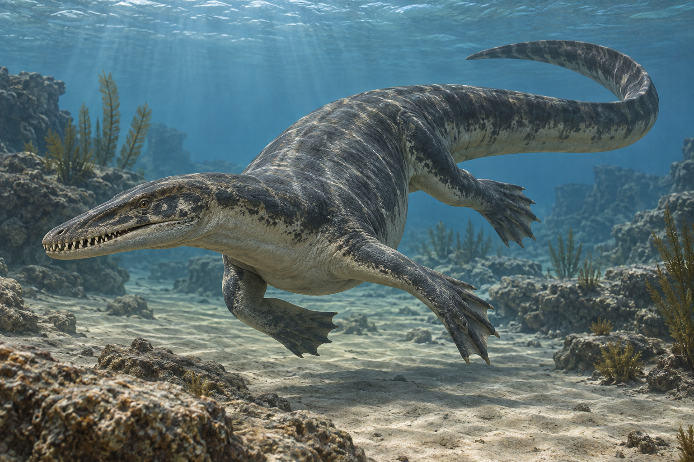

# T03 · *Nothosaurus giganteus* — reference board

> **Scope:** modelling and art-direction board assembled only from existing repository research and canonical/reference catalogues. It is not a new anatomical study.

| Field | Working value |
| --- | --- |
| Representative length | **6 m** (maximum recorded in the swimming dataset: 7 m) |
| Existing catalogue range | 5–7 m |
| Age / locality context | Upper Muschelkalk of Germany and Besano Formation at Monte San Giorgio; Anisian–Ladinian. |
| Canonical status | See the canonical manifest; approval state can change independently of this board. |

## Panel A · Current canonical life reconstruction

The canonical pose is an internal visual contract, not fossil evidence. Colour, pattern, soft-tissue volume and pose remain **inferred** or **speculative** unless the cited research says otherwise.

## Panel B · Existing skeletal or specimen evidence

**Catalogue evidence:** [Nothosaurus giganteus full skeleton view 2.jpg](https://commons.wikimedia.org/wiki/File:Nothosaurus_giganteus_full_skeleton_view_2.jpg) — Neil Pezzoni, CC BY-SA 4.0. PIMUZ T 4829, a complete skeleton of Nothosaurus giganteus (= Paranothosaurus amsleri). The specimen was found at Cava Tre Fontane, an outcrop on Monte San Giorgio preserving the late Anisian (Middle Triassic) Besano Formation. Photo taken at the Paleontological Museum of Zurich.

This linked image is selected from the existing repository catalogue by a filename/description match for skeletal, fossil, holotype, specimen, or skull evidence. Check whether it depicts the target species or a comparative taxon before modelling.

## Panel C · Anatomy that must read

- **Model target:** Interlocking fangs with mouth shut; wing-shaped humeri; webbed feet with distinct digits.
- Preserve the full silhouette, tail and every limb or fin in modelling inputs.
- Treat hard-part anatomy described from specimens as **supported**; treat soft-tissue completion and locomotor posture as **inferred** unless the research notes explicitly raise or lower confidence.

## Panel D · Scale and uncertainty

The production representative is **6 m**, from [the repository swimming dataset](../../research/triassic-swimming.json); that dataset records the movement confidence as **modelled** and cites its rationale in the note. The broader displayed range is retained above so the single game representative is not mistaken for a species maximum.

Uncertainty vocabulary follows [research.md](../research.md): **supported** = direct fossil evidence or published functional analysis; **inferred** = reasoned from anatomy or analogues in the cited literature; **speculative** = plausible but untested. The swimming note is not a skeletal source.

## Sources and handling

- [Triassic research notes](../research.md) — age, locality, anatomy, length discussion and claim-level confidence.
- [Reference viewer catalogue](../../research/triassic/viewer/images.json) — external image metadata, creator, licence and source page.
- [Canonical pose documentation](../canonical/README.md) — what the internal image does and does not establish.
- [Image/model request anatomy brief](../03-image-and-model-requests.md) — production-critical silhouette checklist.
- [Swimming dataset](../../research/triassic-swimming.json) — representative production length and movement estimate.

Do not redistribute an external image without following its source-page licence. The remotely linked catalogue image is a reference thumbnail and is not copied into runtime assets.
