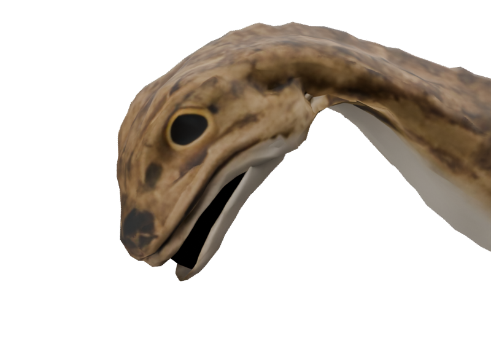
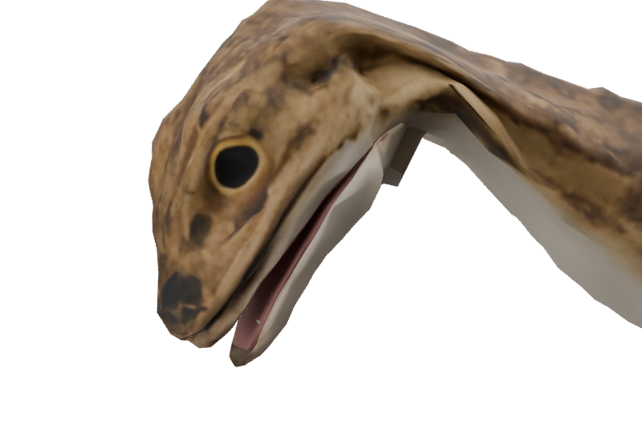

# ShoreKit mouth conversion — T3D-09

Owner: `/root/throat_audit`; **finished**. All three packaged pairs pass the scoped mouth conversion checks.

Coelophysis, Macrocnemus and Tanystropheus used a separate `shorekit.oral_lining` implementation,
so restoring the marine helper alone left their stretching sacs in place. The preserved branch's
settled changes are ported from its merge base; the current running, neck motion, centreline and
limb-root repairs remain intact.

ShoreKit now delegates to the same `oral_shells` and `oral_object` helpers as the marine builders.
Palate vertices are wholly skull-owned and floor vertices wholly jaw-owned. Each builder supplies
measured head room; Macrocnemus casts around its offset mouth centre. Coelophysis also closes the
posterior cut cross-section with the source skin rather than expecting a hidden hinge plug to
cover it.

The source-reference checker now follows the explicit `from tripo import ...` re-exports and
verifies their definitions exist in the marine module. Previously it rejected valid re-exports
such as `cap_cut` and `rim_flange`; simply accepting all imports would conceal misspellings.
The updated check resolves all 116 references in the three builders, and all four Python sources
pass AST parsing. Rebuilt asset and playback results are recorded below as each delivery finishes.

## Tanystropheus — finished

The authored/puppet/LOD exports have two independently closed shells: 236 skull-owned and 236
jaw-owned triangles, no mixed vertices, no bridging triangles and no boundary edges. The packaged
paired audit passes all 28 clips and 38-bone/anchor parity. The strict culling comparison passes
Bite at 0.25 s and SnapRight at 0.25 s with **zero pixels seen through the body**. The before/after
Bite close-ups show the floor seated in the mandible without a wall across the gape. Portraits and
the SHA-bound delivery record are refreshed. The viewer/runtime oral-geometry hide stays unchanged.

## Coelophysis — mouth conversion finished

The initial rebuild still leaked **2,367 through-body pixels** during SnapRight. The skull skin
was partly carried by the neck while its palate followed the skull, and the detached posterior
jaw used a different weight field from the body's copy of the cut. The measured head region is
now pinned after relaxation; the jaw blends into the same posterior field over 0.022 raw units.
The kit's optional post-relax pin is used only for these anatomical constraints; limb smoothing
and runner animation remain intact. It also runs after the short-edge cluster weld, which
otherwise perturbs the jaw's copy even with zero diffusion passes.

The packaged authored/puppet audit samples **106/69 duplicate posterior rim vertices**, at
61 phases of all 29 clips: the worst gap is exactly zero. Bite at 0.25 s and SnapRight at 0.24 s
now have zero through-body pixels in the strict culling comparison. All three packaged variants
pass the separate closed-shell check, and portraits/delivery hashes are refreshed. The attachment
audit selects the anatomical body by vertex count after excluding oral/tooth meshes, because
export node ordering can put tooth rows first.

The first port also exposed an overbroad cap predicate: it selected every boundary behind the
hinge, including a tiny remote foot boundary, creating 12 long fan triangles toward the throat.
Direct comparison found zero such long triangles in the pre-conversion model; this was a port
regression, **not** a pre-existing source defect. The cap is now restricted to the exact posterior
head plane. The source remains untouched and no regeneration was needed. The maximum rest edge
is now 0.427 units authored and 0.306 puppet; the packaged audit rejects nonlocal edges over 0.7.
The final cervical retains explicit ownership of the short anatomical collar behind the cranium,
so the skull constraint does not leave that animated joint owning no skin.

## Macrocnemus — finished

The first shell-only rebuild let the rigid palate poke above the flexible skull during Snatch.
The measured skull region is now constrained after diffusion, with a smooth collar into the
existing neck. The posterior mandible uses the same source-coordinate field as the body's cut
and blends to the jaw over 0.022 raw units. Its **68 authored/46 puppet** shared-rim vertices stay
exactly attached at 61 phases of all 26 clips. The paired runner/action audit and all-joint skin
ownership check pass. Authored/puppet/LOD shell topology passes, and Bite at 0.2 s plus Snatch at
0.3 s both show zero through-body pixels under strict culling. Fresh portraits and the delivery
record are included. The source's pale creased gular skin remains visible; it is not a sac wall.

## Delivery checks and limits

All 448 Triassic checks, typecheck and the production build passed. The final Coelophysis cap-only
correction also passed paired action/attachment, rest-edge, all-joint ownership, oral topology,
base-pose and review-manifest checks. `shorekit-audit.json` samples all 166 authored/puppet clips
over 4,150 poses and binds the results to the delivered GLB hashes.

The deformation instrument is a diagnostic, not an intersection solver: Coelophysis still has a
7.62× cervical edge ratio during a hard snap (0.00986→0.07505 world units), Macrocnemus 3.50× and
Tanystropheus 1.22× across the reviewed models. The exact posterior attachment and strict selected
gape views pass, but these numbers are not a claim that every possible surface intersection is
absent. Runtime and viewer oral-shell visibility policy is unchanged.
