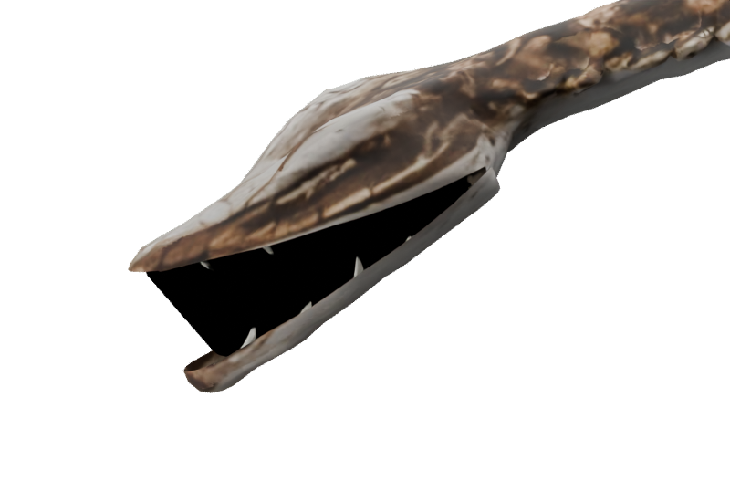
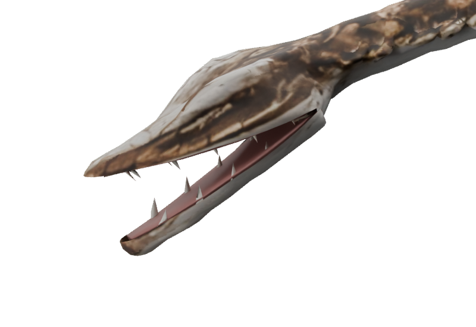
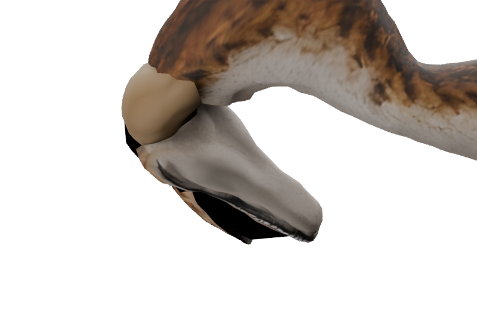
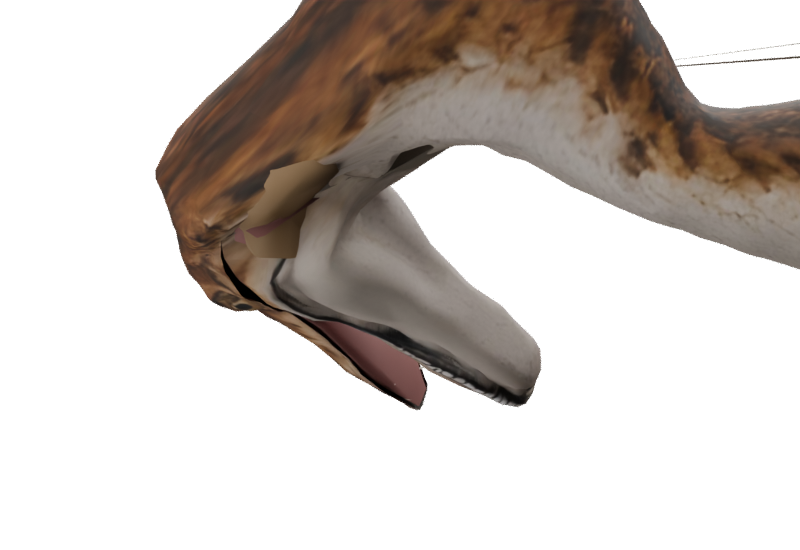

# ShoreKit mouth conversion — T3D-09

Owner: `/root/throat_audit`; active until all three packaged pairs pass.

Coelophysis, Macrocnemus and Tanystropheus used a separate `shorekit.oral_lining` implementation,
so restoring the marine helper alone left their stretching sacs in place. The preserved branch's
settled changes are ported from its merge base; the current running, neck motion, centreline and
limb-root repairs remain intact.

ShoreKit now delegates to the same `oral_shells` and `oral_object` helpers as the marine builders.
Palate vertices are wholly skull-owned and floor vertices wholly jaw-owned. Each builder supplies
measured head room; Macrocnemus casts around its offset mouth centre. Coelophysis also closes the
posterior cut cross-section with the source skin rather than expecting a hidden hinge plug to
cover it.

The source-reference checker now follows the explicit `from tripo import ...` re-exports and
verifies their definitions exist in the marine module. Previously it rejected valid re-exports
such as `cap_cut` and `rim_flange`; simply accepting all imports would conceal misspellings.
The updated check resolves all 116 references in the three builders, and all four Python sources
pass AST parsing. Rebuilt asset and playback results are recorded below as each delivery finishes.

## Tanystropheus — finished

The authored/puppet/LOD exports have two independently closed shells: 236 skull-owned and 236
jaw-owned triangles, no mixed vertices, no bridging triangles and no boundary edges. The packaged
paired audit passes all 28 clips and 38-bone/anchor parity. The strict culling comparison passes
Bite at 0.25 s and SnapRight at 0.25 s with **zero pixels seen through the body**. The before/after
Bite close-ups show the floor seated in the mandible without a wall across the gape. Portraits and
the SHA-bound delivery record are refreshed. The viewer/runtime oral-geometry hide stays unchanged.

## Coelophysis — mouth conversion finished

The initial rebuild still leaked **2,367 through-body pixels** during SnapRight. The skull skin
was partly carried by the neck while its palate followed the skull, and the detached posterior
jaw used a different weight field from the body's copy of the cut. The measured head region is
now pinned after relaxation; the jaw blends into the same posterior field over 0.022 raw units.
The kit's optional post-relax pin is used only for these anatomical constraints; limb smoothing
and runner animation remain intact. It also runs after the short-edge cluster weld, which
otherwise perturbs the jaw's copy even with zero diffusion passes.

The packaged authored/puppet audit samples **111/68 duplicate posterior rim vertices**, at
61 phases of all 29 clips: the worst gap is exactly zero. Bite at 0.25 s and SnapRight at 0.24 s
now have zero through-body pixels in the strict culling comparison. All three packaged variants
pass the separate closed-shell check, and portraits/delivery hashes are refreshed. The attachment
audit selects the anatomical body by vertex count after excluding oral/tooth meshes, because
export node ordering can put tooth rows first.

Residual outside the mouth conversion: thin authored-source skin slivers behind the neck are
visible even at rest (also present before this change); the puppet does not have them. This is
recorded for a separate bounded source cleanup, not represented as a mouth regression or a full
visual approval of all Coelophysis geometry.
